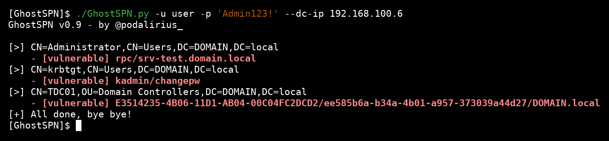
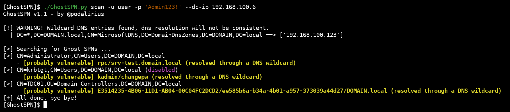

# GhostSPN

<p align="center">
    List accounts with Service Principal Names (SPN) not linked to active dns records in an Active Directory Domain.
    <br>
    
    <a href="https://twitter.com/intent/follow?screen_name=podalirius_" title="Follow"></a>
    <a href="https://www.youtube.com/c/Podalirius_?sub_confirmation=1" title="Subscribe"></a>
    <br>
</p>

## Features

 - [x] Lists all accounts (users, computers) with 
 - [x] Checks for DNS wildcard presence before resolving names.

## Usage of scan mode

```
GhostSPN v1.1 - by @podalirius_

usage: GhostSPN.py scan [-h] [-u USERNAME] [-p PASSWORD] [-d DOMAIN] [--hashes [LMHASH]:NTHASH] [--no-pass] --dc-ip ip address [--ldaps] [-v] [--debug]

options:
  -h, --help            show this help message and exit

Credentials:
  -u USERNAME, --username USERNAME
                        Username to authenticate to the machine.
  -p PASSWORD, --password PASSWORD
                        Password to authenticate to the machine. (if omitted, it will be asked unless -no-pass is specified)
  -d DOMAIN, --domain DOMAIN
                        Windows domain name to authenticate to the machine.
  --hashes [LMHASH]:NTHASH
                        NT/LM hashes (LM hash can be empty)
  --no-pass             Don't ask for password (useful for -k)
  --dc-ip ip address    IP Address of the domain controller. If omitted it will use the domain part (FQDN) specified in the target parameter
  --ldaps               Use LDAPS. (default: False)
  -v, --verbose         Verbose mode. (default: False)
  --debug               Debug mode. (default: False)
```

## Example

Example:



## Special case: DNS wildcards

In case DNS wildcards are present in the domain, GhostSPN autodetect if the entry was resolved from a wildcard entry.


